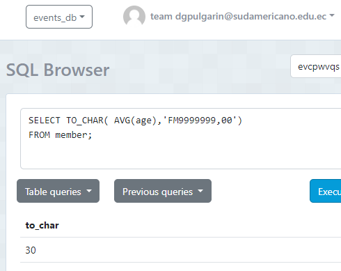
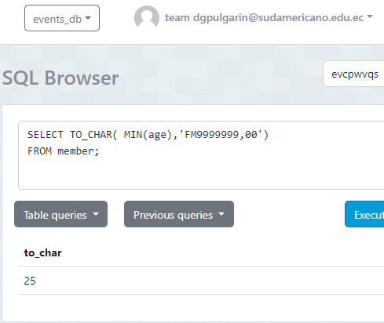
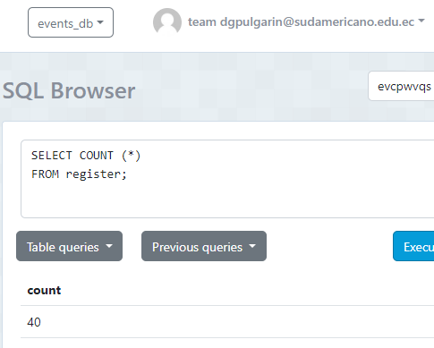
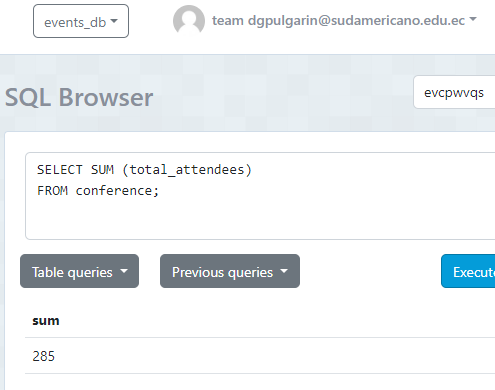
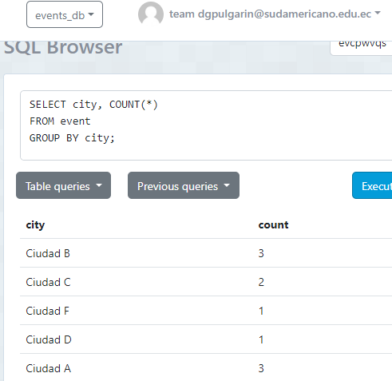
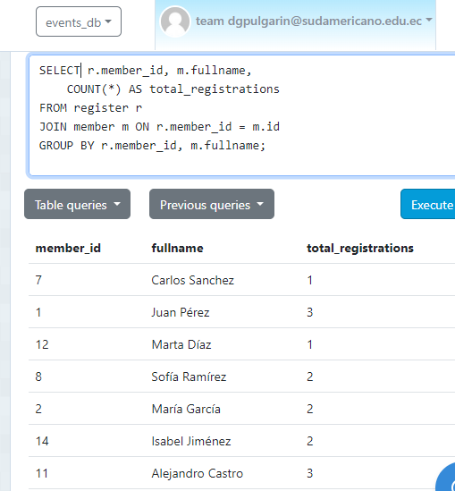
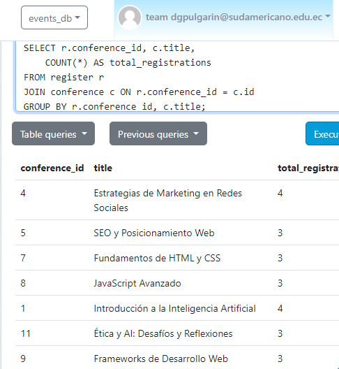

# Sentencias SQL y Capturas

## 1. Obtener la edad promedio de los miembros:
### Sentencia
SELECT COUNT(*) 
FROM Product 
WHERE category = 'Audio';

## 2. Obtener la edad mínima de los miembros:
### Sentencia
SELECT COUNT(*) 
FROM Client 
WHERE city = 'Cuenca';

## 3. Obtener el número total de registros asistidos:
### Sentencia
SELECT COUNT(*) 
FROM Product 
WHERE price BETWEEN 500 AND 1000;

## 4. Obtener el número total de asistentes a todas las conferencias:
### Sentencia
SELECT * 
FROM Client 
WHERE city = 'Quito' AND type_of_client = 'A';

## 5. Obtener el número total de eventos por cada ciudad:
SELECT * 
FROM Product 
WHERE category = 'Audio' AND price > 500;

## 6. Obtener el número de registros por cada miembro:
### Sentencia

SELECT * 
FROM Product 
WHERE year_of_product = 2022 AND country_of_origin = 'China';

## 7. Obtener el número de registros por cada conferencia:
SELECT * 
FROM Client 
WHERE fullname LIKE 'J%';

